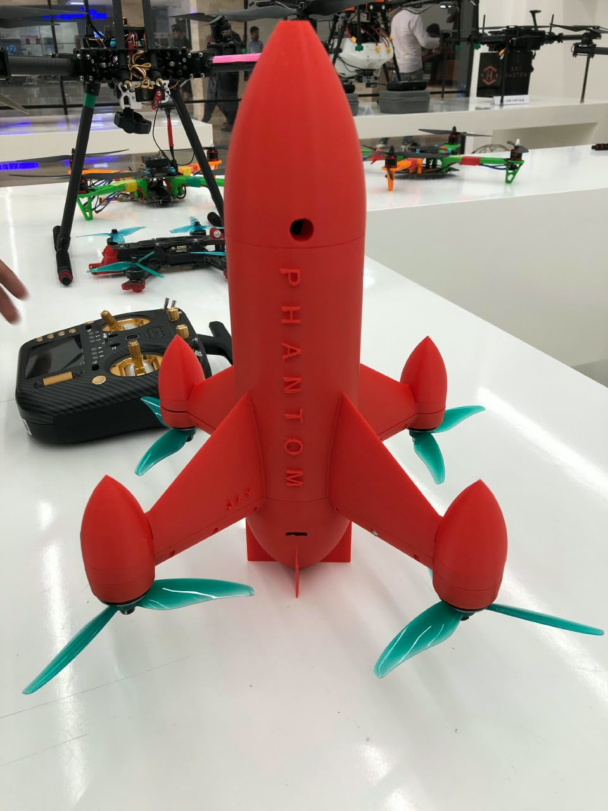
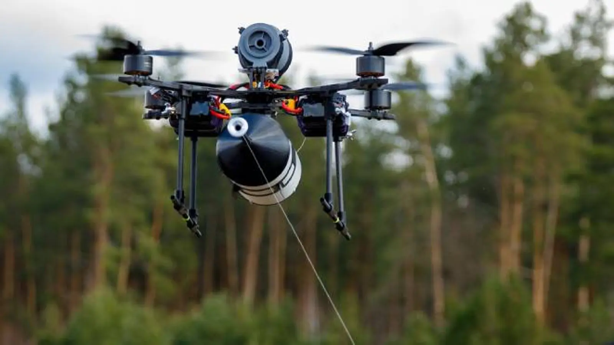
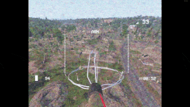
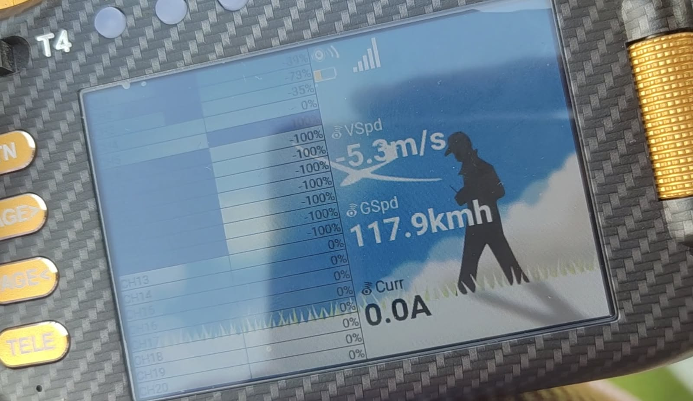
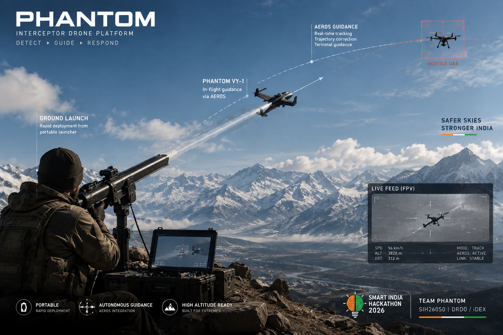
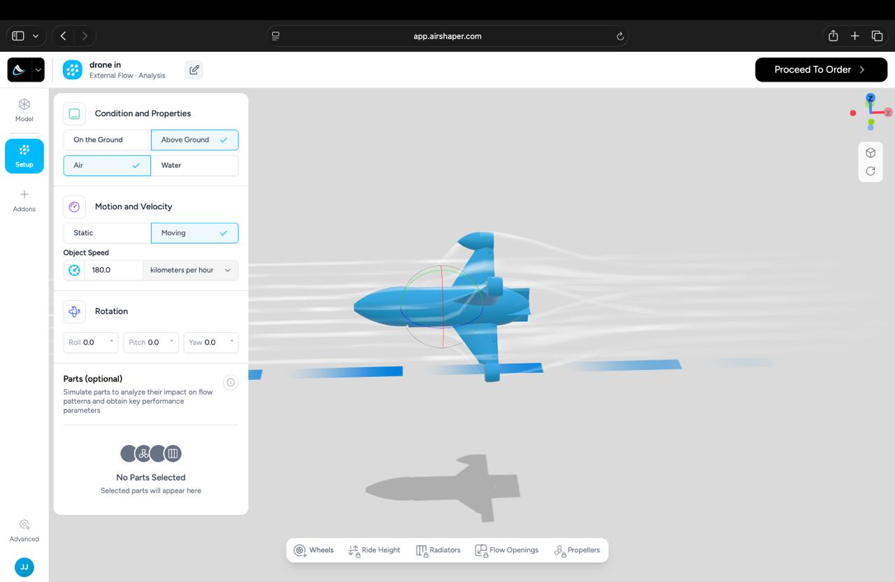

# PHANTOM — High-Altitude Counter-UAS Interceptor

**Smart India Hackathon 2026 · SIH26050 · Team PHANTOM · Team ID 188**

> **From prototype to high-altitude-ready counter-UAS interceptor.**

PHANTOM is a hardware/software interceptor-drone platform being developed in alignment with **Smart India Hackathon 2026 Problem Statement SIH26050 — High Altitude Performance Optimization and Robust Design of Anti-Drone System**, under **DRDO / iDEX**, Hardware, Robotics & Drones.

This repository contains the PHANTOM project website and its supporting media. The website is intended to document the physical prototype, current development status, engineering approach, test evidence, simulation work, threat context and future roadmap.

---

## Project Identity

| Field | Details |
|---|---|
| Team | **PHANTOM** |
| Team ID | **188** |
| Problem Statement | **SIH26050** |
| Problem Title | **High Altitude Performance Optimization and Robust Design of Anti-Drone System** |
| Organization | **DRDO / iDEX** |
| Category | **Hardware** |
| Domain / Theme | **Defence / Robotics & Drones** |

---

## Project Overview

PHANTOM is an interceptor-based counter-UAS development platform.

The project did not begin as a purely theoretical SIH idea. The team had already been developing an interceptor platform, and SIH26050 closely aligned with the work being undertaken around high-speed flight, camera-based target detection/tracking, flight control, airframe development and environmental robustness.

The central engineering objective is to move from a working interceptor prototype toward a platform that can maintain reliable flight, tracking and mission performance under increasingly demanding environmental conditions.

### Development areas

- Interceptor airframe design
- Propulsion integration
- Flight-control development
- Navigation and state estimation
- Camera-based target detection
- Camera-based target tracking
- Guidance and control development
- Live video transmission
- Power / system monitoring
- Material evaluation
- Aerodynamic simulation
- Environmental robustness
- Future multi-sensor integration

---

## SIH26050 — The Engineering Problem

The SIH problem focuses on anti-drone operation in high-altitude environments where environmental conditions can affect the aircraft and its subsystems.

Key factors include:

- Reduced air density
- Low temperature
- High wind
- Vibration
- Thermal cycling
- Sensor drift
- Propulsion-performance changes
- Structural/material behaviour changes
- Power-system derating
- Navigation and tracking degradation

The challenge is therefore not simply to fly an interceptor, but to preserve useful system performance when the environment itself changes the behaviour of the aircraft.

---

## PHANTOM System Concept

The general mission chain is:

```text
TARGET DETECTION
        ↓
TARGET CUE
        ↓
TARGET TRACKING
        ↓
STATE ESTIMATION
        ↓
GUIDANCE
        ↓
FLIGHT CONTROL
        ↓
INTERCEPTOR RESPONSE
```

A parallel robustness loop is:

```text
ENVIRONMENT MONITORING
        ↓
HEALTH ASSESSMENT
        ↓
ADAPTIVE COMPENSATION
        ↓
CONTROL / MISSION LOOP
```

The long-term objective is a modular architecture in which sensing, navigation, tracking, control and system-health functions can evolve independently while remaining integrated at system level.

---

## Current Prototype

PHANTOM has a **physical interceptor prototype** under active development, fabrication, integration, flight testing and tuning.

### Current platform work includes

- Custom 3D-printed interceptor airframe
- Integrated motors / propulsion
- Flight controller and IMU stabilization
- Navigation / telemetry development
- Onboard camera
- Camera-based target detection
- Camera-based target tracking
- Live VTX video transmission
- FPV-goggle viewing
- Flight testing and tuning
- Aerodynamic simulation
- Material experimentation

### Current measured headline

**117.9 km/h — maximum tested physical flight speed**

This value is treated as a measured project result.

The project deliberately separates measured results from simulation inputs and future targets.

---

## Target Detection and Tracking

The current visual sensing path uses the interceptor's camera.

```text
ONBOARD CAMERA
      ↓
IMAGE STREAM
      ↓
TARGET DETECTION
      ↓
TARGET TRACKING
      ↓
RELATIVE TARGET INFORMATION
      ↓
GUIDANCE / CONTROL
```

The current development already demonstrates camera-based target tracking.

The live video path is:

```text
CAMERA → VTX → FPV GOGGLES
```

This provides a practical visual observation chain while the computer-vision and guidance stack continues to develop.

---

## Threat Context

The website includes visual material showing two important drone-threat classes.

### Conventional FPV threats

Small, fast and agile UAVs can create short response windows and may require a rapid response layer.

### Fiber-optic-controlled UAVs

Fiber-optic-controlled FPV architectures change the assumptions behind conventional RF-oriented countermeasures. This supports the broader system argument for combining detection/tracking with an interceptor response layer rather than depending on one countermeasure mechanism alone.

The supplied threat imagery is used as **context and explanation**, not as proof of a universal counter-UAS capability.

---

## High-Altitude Engineering

### Reduced air density

Reduced atmospheric density can affect propulsion and aerodynamic behaviour.

PHANTOM's engineering path includes:

- Aerodynamic analysis
- Propulsion characterization
- Geometry iteration
- Flight-control tuning
- Higher-altitude validation

### Low temperature

Low temperature can influence:

- Battery performance
- Electronics
- Materials
- Connectors and cables
- Mechanical behaviour

The project therefore includes material experimentation and a future thermal/environmental qualification path.

### Wind and vibration

Disturbances can influence:

- Attitude stability
- Position estimation
- Camera stability
- Target tracking
- Guidance

Future work includes stronger disturbance compensation and adaptive-control development.

---

## Materials and Airframe Development

The team has evaluated multiple airframe materials, including:

- **PLA**
- **CF-PLA**
- **ABS**

The purpose is to investigate trade-offs involving:

- Structural strength
- Mass
- Rigidity
- Printability
- Environmental behaviour
- Manufacturing practicality

Additional numerical material results should only be added after actual measurements are recorded.

---

## Aerodynamic Simulation

PHANTOM uses simulation as part of an iterative engineering loop:

```text
CAD
 ↓
AERODYNAMIC SIMULATION
 ↓
DESIGN ITERATION
 ↓
FABRICATION
 ↓
FLIGHT TEST
 ↓
OBSERVATION / DATA
 ↓
NEXT ITERATION
```

The supplied aerodynamic simulation material includes a **180 km/h** simulation case.

> **Important:** 180 km/h is a simulation condition/input, not a measured flight-speed result.

The measured physical result highlighted by the project is **117.9 km/h**.

---

## Current vs Future Capability

The project intentionally distinguishes demonstrated functions from future work.

### Current / Demonstrated Development

- Physical interceptor prototype
- Flight-control integration
- Camera-based target detection
- Camera-based target tracking
- Live VTX feed
- FPV-goggle viewing
- Navigation / telemetry work
- Material iteration
- Flight testing
- Aerodynamic simulation

### In Development

- Robust guidance
- Adaptive control
- Environmental monitoring
- Health monitoring
- High-altitude qualification
- Disturbance compensation
- Improved state estimation

### Future — V3 / V4 Direction

**Radar + EO sensor fusion**

Conceptually:

```text
RADAR
  +
EO / CAMERA
  +
NAVIGATION / STATE ESTIMATION
        ↓
MULTI-SENSOR TARGET PICTURE
        ↓
GUIDANCE
```

Radar integration is a **future development objective**, not a current prototype claim.

---

## Validation Philosophy

The intended validation flow is:

```text
GROUND TEST
      ↓
LOW-ALTITUDE FLIGHT
      ↓
TRACKING TEST
      ↓
GUIDANCE / CONTROL TEST
      ↓
ENVIRONMENTAL STRESS TEST
      ↓
HIGHER-ALTITUDE VALIDATION
      ↓
SYSTEM DEMONSTRATION
```

Important metrics for future qualification work include:

- Tracking accuracy
- Response time
- Flight stability
- Navigation / position error
- Endurance
- Target-lock consistency
- Environmental tolerance
- Power and thermal behaviour

Only measured values should be presented as results.

---

## Roadmap

### V1 — Working Interceptor

Current platform:

- Physical interceptor
- Flight-control system
- Camera system
- Camera tracking
- Live video
- Flight testing

### V2 — High-Altitude Robustness

Planned focus:

- Thermal hardening
- Environmental monitoring
- Component qualification
- Disturbance compensation
- Improved energy management
- Representative environmental validation

### V3 — Multi-Sensor Expansion

Planned focus:

- Additional sensing
- Improved state estimation
- Multi-sensor target picture

### V4 — Radar + EO

Planned focus:

- Radar integration
- EO/radar fusion
- Improved detection/tracking architecture

### V5 — Networked Platforms

Longer-term research direction:

- Multiple aerial platforms
- Shared target information
- Coordinated mission logic
- Distributed counter-UAS architecture

---

## Media Assets

The website currently uses the following local media:

| File | Purpose |
|---|---|
| `eg.png` | PHANTOM system / deployment visual |
| `inter.jpeg` | Physical PHANTOM interceptor prototype |
| `kill.gif` | FPV threat / kill-cam reference |
| `opticaldrone.webp` | Fiber-optic drone reference |
| `lau.gif` | PHANTOM launch footage |
| `speed.jpeg` | Speed / transmitter evidence |
| `sim.jpeg` | Aerodynamic simulation evidence |

---

## Repository Structure

For GitHub Pages, the recommended structure is:

```text
phantom/
├── index.html
├── README.md
└── assets/
    ├── eg.png
    ├── inter.jpeg
    ├── kill.gif
    ├── opticaldrone.webp
    ├── lau.gif
    ├── speed.jpeg
    └── sim.jpeg
```

Keep filenames simple and consistent.

---

## Important: Local Paths vs GitHub Paths

During local development, the website may use:

```text
/home/marshal/Downloads/Sihimg/
```

That path exists only on the development PC. GitHub Pages cannot load files from that directory.

Before publishing, move the media into the repository and change references to **relative paths**.

### Correct examples

```html

```

```html

```

```html

```

```html

```

```html

```

```html

```

```html

```

Relative paths are the key requirement for the hosted site.

---

## Recommended Repository Name

Use:

```text
phantom
```

For a GitHub username `YOUR_USERNAME`, the project Pages URL becomes:

```text
https://YOUR_USERNAME.github.io/phantom/
```

This gives the project a clean, memorable URL.

---

## Recommended Repository Description

> **PHANTOM — High-altitude interceptor-based counter-UAS platform | SIH26050 | Team 188**

---

## Suggested GitHub Topics

```text
smart-india-hackathon
sih-2026
sih26050
drdo
idex
counter-uas
counter-drone
robotics
drones
uav
interceptor-uav
computer-vision
flight-control
aerospace
high-altitude
```

---

## Local Development

From the repository directory:

```bash
python3 -m http.server 8000
```

Then open:

```text
http://localhost:8000
```

Using a local server makes it easier to catch broken relative paths and media-loading problems before deployment.

---

## GitHub Deployment

```bash
git init
git add .
git commit -m "Initial PHANTOM website"
git branch -M main
git remote add origin https://github.com/YOUR_USERNAME/phantom.git
git push -u origin main
```

Then enable **GitHub Pages** in the repository settings using:

- Branch: `main`
- Folder: `/ (root)`

The site should then be available at:

```text
https://YOUR_USERNAME.github.io/phantom/
```

---

## Data Integrity Convention

The website and repository should distinguish three types of information.

### MEASURED

Physically tested or recorded results.

Current headline:

**117.9 km/h — maximum tested speed**

### SIMULATION

Digital model or simulation condition.

Current example:

**180 km/h — aerodynamic simulation case**

### FUTURE / TARGET

Planned capabilities or design objectives.

Examples:

- Radar integration
- Radar + EO fusion
- Advanced adaptive guidance
- Greater environmental qualification
- Representative high-altitude testing
- Networked / multi-agent extensions

This distinction should be maintained in the website, documentation and presentations.

---

## What PHANTOM Does Not Claim

Unless separately demonstrated and documented, the project should not be described as:

- A fielded military system
- A deployed defence product
- A universally effective counter-UAS solution
- Fully autonomous when the demonstrated system is not fully autonomous
- Radar-equipped in the current prototype
- Fully high-altitude qualified before representative qualification testing

The most accurate description is:

> **An actively developed hardware/software interceptor platform progressing toward the requirements of SIH26050.**

---

## Development Philosophy

PHANTOM follows an iterative engineering cycle:

```text
BUILD
  ↓
TEST
  ↓
MEASURE
  ↓
IDENTIFY FAILURE MODES
  ↓
MODEL
  ↓
IMPROVE
  ↓
REBUILD
```

The objective is to connect:

- Aerodynamics
- Propulsion
- Structure
- Electronics
- Sensing
- Navigation
- Control
- Environmental effects
- Mission logic

into a repeatable engineering process.

---

## Project Message

> **We are not starting from the problem. We are already building the solution.**

PHANTOM is progressing from an existing physical interceptor toward a robust high-altitude counter-UAS platform through prototype development, flight testing, camera-based tracking, aerodynamic simulation, material evaluation, environmental engineering and future sensor fusion.

---

## Disclaimer

This is a student/university engineering development project created for research, prototyping, testing and Smart India Hackathon participation.

System descriptions should be interpreted according to the demonstrated development status. Future capabilities are identified as future work rather than current operational capability.
